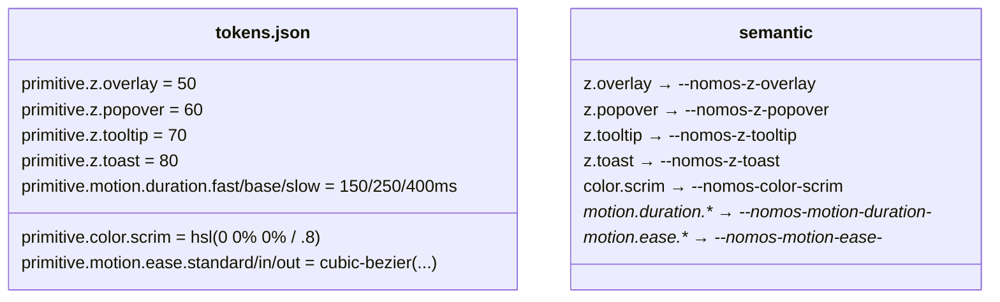
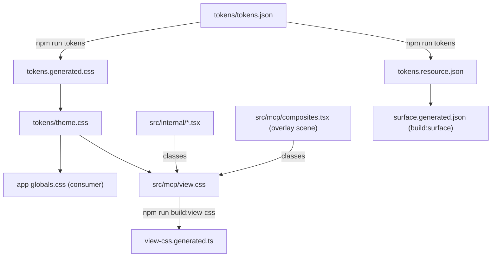

# Tech Plan — Overlay foundation (#9)

> Tech Plan for the first slice of the overlay epic (issue #9). The epic brief is
> `Epic_Brief_—_Overlay_&_disclosure.md`. The decision record is ADR 0027.

## Architectural Approach

### Key Decisions

| Decision | Choice | Rationale |
|---|---|---|
| Layer scale | `semantic.z.{overlay,popover,tooltip,toast}` = 50/60/70/80, aliasing `primitive.z.*` | Named by usage, tens leave room; two tiers keep the skin contract (ADR 0004). |
| Scrim | `semantic.color.scrim` at **4 HSL components** (`[0,0,0,0.8]`) | The opacity is part of the token; no `80` literal survives. |
| Motion | `motion.duration.{fast,base,slow}` + `motion.ease.{standard,in,out}` | Motion is a token; timing is skinnable. |
| Animation impl. | Hand-written `@keyframes` + `@utility` in `tokens/theme.css` | No dependency (ADR 0020); a plugin could not read the tokens; `theme.css` is the raccord both app and views load. |
| View scan | `@source '../internal'` in `view.css` | A promoted overlay's classes must be compiled into `VIEW_CSS`. |
| Proof | Composite scene `overlay` + a `VIEW_CSS` test | Satisfies "a view renders styled and animated" without pre-empting the `Dialog` brick (#10). |

### Critical Constraints

- **One source.** Values change in `tokens/tokens.json` only, then
  `npm run tokens`. `tokens.generated.css` and `tokens.resource.json` are replayed
  and committed (ADR 0004, drift gate `tokens:check`).
- **Derivation must widen.** `src/tokens/build.mjs` `cssValue` must render a
  four-component HSL colour as `H S% L% / A` and a `cubicBezier` array as
  `cubic-bezier(...)`; both are covered by tests in `src/tokens/tokens.test.ts`.
- **Parity.** Every semantic slot is filled in both modes; the new `z`/`motion`
  slots are mode-invariant but filled on both sides (ADR 0009, `tokens.test.ts`).
- **Surface.** New slots appear in `nomos://tokens`, hence in
  `surface.generated.json`; replay `npm run build:surface` (ADR 0024).
- **`theme.css` is imported both sides.** The `@utility` / `@keyframes` blocks
  reach the app (via its `globals.css`) and the views (via `src/mcp/view.css`)
  through the same file — no new export, no second import to forget.
- **Motion is opt-out.** `@media (prefers-reduced-motion: reduce)` neutralises the
  animation utilities.

---

## Data Model

New semantic slots (paths → CSS custom properties). All are filled in `dark` and
`light`; none is mode-specific yet.

### Table Notes

- `z.*` uses `$type: number`; `motion.duration.*` uses `$type: duration`
  (`{ value, unit }`); `motion.ease.*` uses `$type: cubicBezier` (a 4-number
  array). These are the DTCG types; the derivation reads them only to render.
- `color.scrim` is the first four-component colour: it exercises the new alpha
  branch of `cssValue` and proves the pattern for future translucent slots.

---

## Component Architecture

### Layer Overview

### New Files & Responsibilities

| File | Purpose |
|---|---|
| `docs/adr/0027-overlay-layer-scrim-and-motion-as-tokens.md` | The decision record (#9 AC). |
| `.changeset/overlay-layer-scrim-motion.md` | Minor bump + migration note. |
| `docs/Epic_Brief_—_Overlay_&_disclosure.md`, `docs/Tech_Plan_—_Overlay_foundation.md` | Planning artifacts. |

### Component Responsibilities

**`tokens/theme.css`** (extended)
- Maps `--color-scrim`, defines `z-overlay`/`z-popover`/`z-tooltip`/`z-toast`
  utilities and the overlay `@keyframes` + `@utility` animations, each reading a
  duration and a curve token; adds the reduced-motion reset.

**`src/internal/{sheet,select,dropdown-menu,tooltip}.tsx`, `src/features/toast.tsx`** (edited)
- Read the new slots: `z-overlay` / `z-popover` / `z-tooltip` / `z-toast`,
  `bg-scrim`, `animate-overlay-in/out`, `animate-content-in/out`,
  `animate-slide-in/out-{side}`.

**`src/mcp/composites.tsx`** (extended)
- Adds the `overlay` scene: a `Sheet open` using the internals, so the foundation
  is previewable as `ui://nomos/composite/overlay` before the `Dialog` brick.

### Failure Mode Analysis

| Failure | Behavior |
|---|---|
| A new slot forgets a mode | parity test in `tokens.test.ts` fails. |
| A component keeps a hard-coded layer/scrim | `tokens.test.ts` "disappearance of hard-coded values" fails. |
| `view.css` misses `../internal` | `VIEW_CSS` loses `.bg-scrim`/keyframes; the new app-view test fails. |
| Generated artifact drifts | the matching `*:check` fails in CI. |

---

## References

- Epic Brief: `docs/Epic_Brief_—_Overlay_&_disclosure.md`
- ADR 0027; ADR 0003, 0004, 0008/0009, 0020, 0022, 0024.
- Issues: #9 (this slice), #8 (epic), #10 (Dialog pilot).
